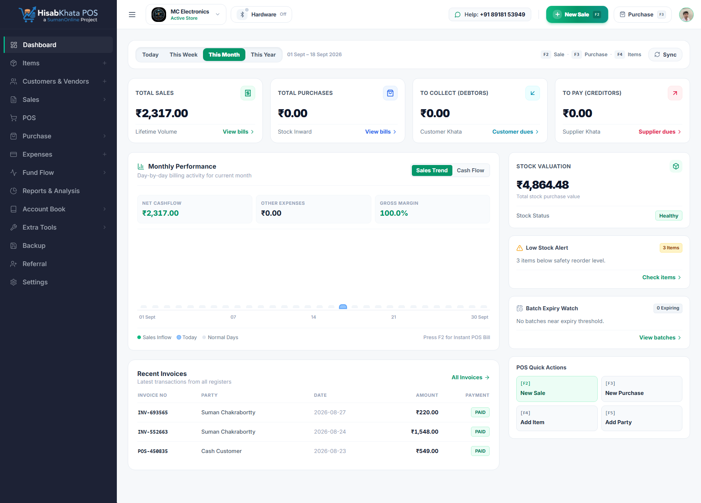
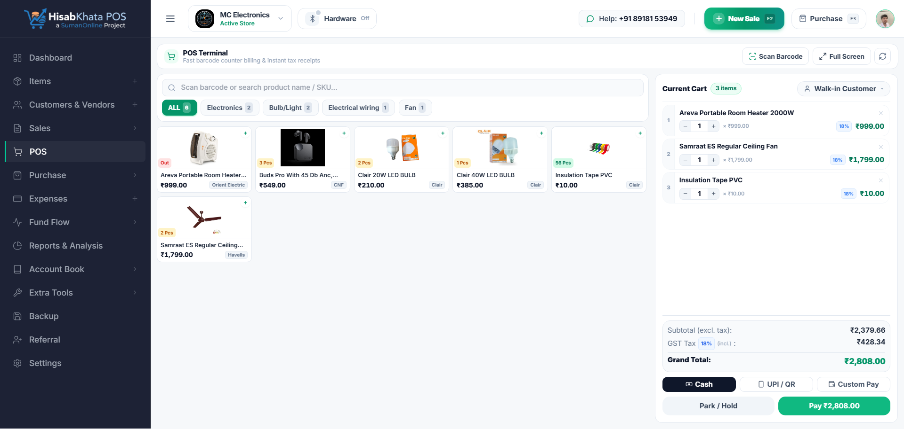
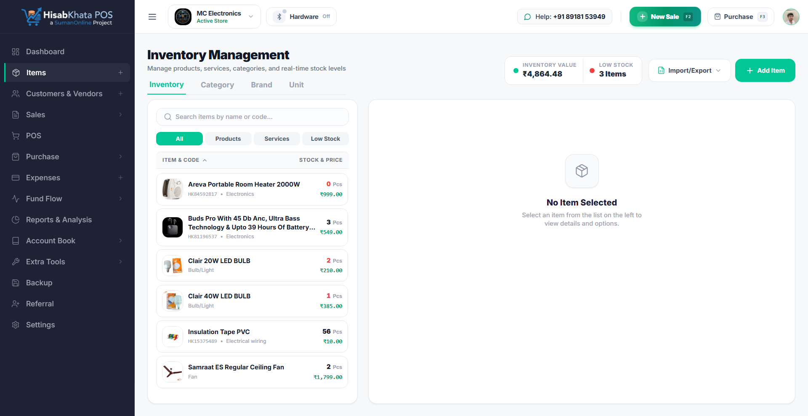
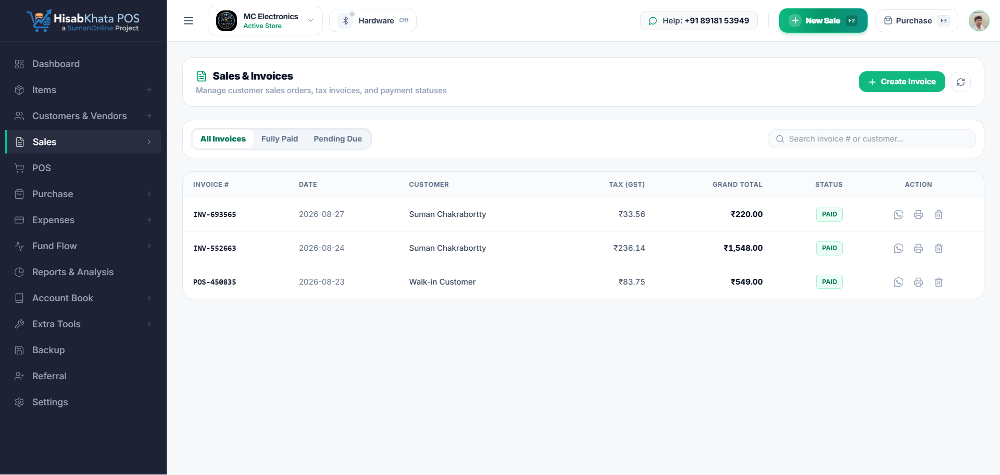
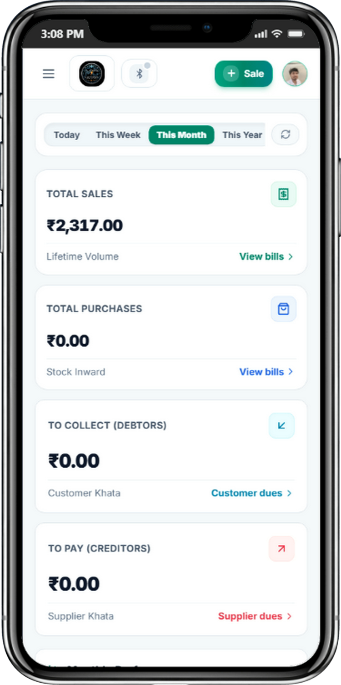
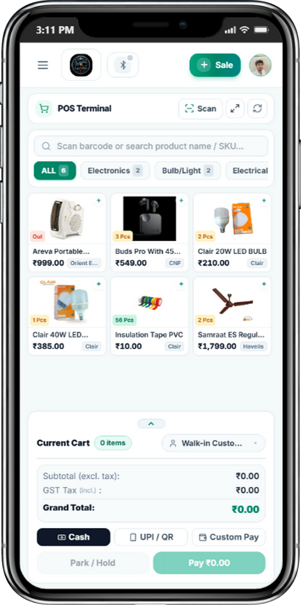
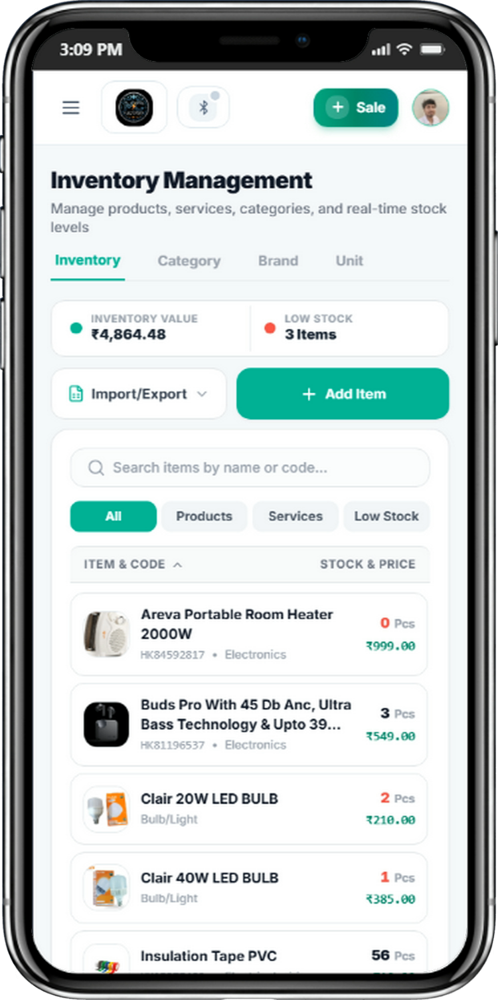

<div align="center">

# HisabKhata POS 🏪⚡
### Enterprise-Grade, 100% Offline-First GST Billing & Retail Management Platform

[](https://react.dev/)
[](https://vitejs.dev/)
[](https://workers.cloudflare.com/)
[](https://developers.cloudflare.com/d1/)
[](https://developers.cloudflare.com/r2/)
[](https://developer.mozilla.org/en-US/docs/Web/API/IndexedDB_API)
[](https://groq.com/)
[](https://groq.com/)
[](LICENSE)

<p align="center">
  <a href="https://pos.hisabkhata.sumanonline.com" target="_blank"><b>🌐 Production Live App</b></a> •
  <a href="#-architecture--offline-first-protocol"><b>🏗️ System Architecture</b></a> •
  <a href="#-comprehensive-features-specification"><b>✨ Features</b></a> •
  <a href="#-5-generative-ai-catalog--intelligence-engine"><b>🤖 AI Engine</b></a> •
  <a href="#-quick-start-guide"><b>🚀 Quick Start</b></a> •
  <a href="#-hardware-integration"><b>🖨️ Hardware Setup</b></a> •
  <a href="#-deployment"><b>☁️ Deployment</b></a>
</p>

</div>

---

## 📌 Executive Summary

**HisabKhata POS** is an enterprise-grade, edge-native Progressive Web Application (PWA) designed for small-to-medium retail and wholesale enterprises across India. It bridges the gap between ultra-fast counter billing, full Indian GST tax compliance, inventory warehouse coordination, and customer credit ledger (Khata) accounting.

Engineered with a **strict Local-First (Offline-First) architecture**, HisabKhata eliminates counter downtime during broadband failures or ISP blackouts. All catalog reads, barcode lookups, invoice creations, and thermal print dispatches execute locally in **< 5ms** directly against browser-managed **IndexedDB (`hisabkhata_pos_local_db`)**. When connectivity is restored, an autonomous background synchronization daemon reconciles pending transactions to **Cloudflare D1** with idempotent collision guards.

---

## 🏗️ Architecture & Offline-First Protocol

```text
┌─────────────────────────────────────────────────────────────────────────────────────────┐
│                                CLIENT WORKSTATION (PWA)                                 │
│                                                                                         │
│   [Cashier Touch / Barcode Scan]                                                        │
│                 │                                                                       │
│                 ▼                                                                       │
│   ┌─────────────────────────────┐         ┌─────────────────────────────────────────┐   │
│   │   In-Memory / SWR Cache     │ <=====> │ IndexedDB: hisabkhata_pos_local_db      │   │
│   │   (0ms Instant UI Renders)  │         │ - items (Catalog & Stock Balances)      │   │
│   └─────────────┬───────────────┘         │ - parties (Khata & Customer Directory)  │   │
│                 │                         │ - invoices (Local Billing History)      │   │
│                 ▼                         │ - sync_queue (Transactional Outbox)     │   │
│   [Checkout Action (< 5ms)]               └────────────────────┬────────────────────┘   │
│                 │                                              │                        │
│         ┌───────┴───────┐                                      │                        │
│         ▼               ▼                                      │                        │
│   [Print Receipt]  [Queue Mutation]                            │                        │
│   - ESC/POS 58/80mm     │                                      ▼                        │
│   - A4 Laser PDF        └──────────────────────────> [Background Sync Daemon]           │
└────────────────────────────────────────────────────────────────┼────────────────────────┘
                                                                 │
                                          Automatic Heartbeat & Connectivity State
                                                                 │
                                         ┌───────────────────────┴───────────────────────┐
                                         ▼                                               ▼
                                 [Network Active]                                [Network Offline]
                                         │                                               │
                                         ▼                                               ▼
                     ┌───────────────────────────────────────┐             ┌───────────────────────────┐
                     │    CLOUDFLARE EDGE WORKER (HONO)      │             │   Retain in IndexedDB     │
                     │  api.pos.hisabkhata.sumanonline.com   │             │   - Exit protection guard │
                     └───────────────────┬───────────────────┘             │   - Live UI badge warning │
                                         │                                 └───────────────────────────┘
                         ┌───────────────┴───────────────┐
                         ▼                               ▼
            ┌─────────────────────────┐     ┌─────────────────────────┐
            │   Cloudflare D1 (SQL)   │     │   Cloudflare R2 Bucket  │
            │   - Idempotent UUIDs    │     │   - 1-Yr Immutable CDN  │
            │   - Delta stock deducts │     │   - Auto orphaned purge │
            │   - Ledger transactions │     └─────────────────────────┘
            └─────────────────────────┘
```

### Conflict Resolution & Offline Integrity Matrix

| Challenge | Failure Risk | HisabKhata Production Solution |
| :--- | :--- | :--- |
| **Network Drops Mid-Sync** | Duplicate invoices or fragmented tax entries | **Idempotent Client UUIDs**: Every offline invoice is generated with a cryptographically unique `client_uuid`. Cloudflare D1 applies `UNIQUE(company_id, client_uuid)` and `INSERT OR IGNORE`. Repeated retries are guaranteed safe. |
| **Multi-Terminal Numbering** | Multiple offline counters generating identical invoice numbers | **Terminal-Prefixed Alphanumeric Series**: Each register uses an assigned terminal identifier (`OFF-FY-TID-SEQ`). For example: `OFF-2425-C1-0001` and `OFF-2425-C2-0001`. 100% GST-compliant with zero numbering collisions. |
| **Multi-Counter Stock Oversell** | Two disconnected counters selling the same limited item | **Atomic Relative Deltas**: Synchronizations execute `current_stock = current_stock - ?` rather than absolute overwrite sets. Invoices with negative remaining stock trigger an instant dashboard alert for stock audit. |
| **Accidental Data Eviction** | Browser clearing cache or storage under low disk conditions | **Persistent Storage Grant**: Automatically invokes `navigator.storage.persist()` on initialization, exempting the local database from OS eviction. |
| **Accidental Tab Close** | Cashier closing the browser while bills are pending sync | **Unsynced Exit Guard**: Listens to `beforeunload` and blocks navigation with a native modal if `sync_queue` count > 0. |

---

## ✨ Comprehensive Features Specification

### ⚡ 1. 100% True Offline-First Architecture & Sync Daemon
- **Zero-Latency Counter Billing**: Every read, barcode lookup, invoice generation, and receipt print writes immediately to browser **IndexedDB (`hisabkhata_pos_local_db`)** in `< 5ms`.
- **Durable Local Stores**: Maintains complete local copies of items, customer directories, invoices, and a transactional FIFO mutation queue.
- **Sequential Offline Numbering**: Generates conflict-free GST invoice series per register terminal (e.g. `OFF-2425-C1-0001`), fully compliant with Indian GST naming regulations.
- **Idempotent Background Synchronization**: Continuously tracks network heartbeats. The moment an internet connection is detected, pending bills push to Cloudflare D1 with `client_uuid` deduplication.
- **Permanent Storage Reservation**: Automatically requests `navigator.storage.persist()` on app launch to prevent browser OS memory eviction under storage pressure.
- **Exit Protection Guards**: Prevents cashiers from accidentally closing or navigating away while unsynced offline invoices are queued.

### 🛒 2. Point of Sale (POS) Counter Terminal
- **Sub-Millisecond Barcode Scanning**: Integrated dual-engine camera barcode reader (ZXing + native `BarcodeDetector` API) supporting EAN-13, Code-128, QR, and ITF barcodes.
- **Audible Beep Feedback**: High-frequency synthetic audio confirmation on every successful scan (toggleable in Settings).
- **Cart Suspension & Multiple Held Bills**: Park up to 20 customer carts during peak counter rush and resume them in 1 click without losing line items.
- **Multi-Tender Payments**: Accept Cash, UPI (dynamic BharatPe, PhonePe, Paytm QR), Debit/Credit Cards, Split Tender, and Store Credit (Khata).
- **Fast Customer Add**: Quickly add customer phone and name directly from the POS modal without leaving the billing screen.
- **Fullscreen Kiosk Mode**: 1-click toggle to expand the POS terminal to true kiosk fullscreen mode for dedicated touch monitors.
- **Live Sync Header Pill**: Interactive visual badge displaying real-time connectivity status (🟢 *Online*, 🟡 *Offline (N)*, 🔄 *Syncing*).

### 🇮🇳 3. Complete Indian GST Compliance & Invoicing Suite
- **Bifurcated Tax Computation**: Automatic real-time segregation of CGST (Central Tax), SGST (State Tax), and IGST (Integrated Tax).
- **Dual Tax Calculation Modes**: Supports both **Tax-Exclusive** (tax added on subtotal) and **Tax-Inclusive** (MRP reverse calculation) modes.
- **Audit-Ready Tax Reports**: 1-click export of CA-formatted GSTR-1, GSTR-3B, B2B, B2C, and HSN summary workbooks.
- **Document Types**: Generate Sales Invoices, Purchase Orders, Quotations/Estimates, Delivery Challans, Sales Returns, and Purchase Returns.
- **HSN & SAC Code Classification**: Searchable database of official HSN/SAC codes with tax rate mapping.

### 📦 4. Inventory Control & Stock Ledger
- **Granular Stock Tracking**: Real-time stock decrement upon checkout, opening balance ledger, and low-stock visual alarms.
- **Hierarchical Catalog**: Organize inventory across Categories, Sub-Categories, Brands, and custom Measurement Units.
- **Multi-Tier Pricing Engine**: Define Retail Sale Price, Wholesale Price, Dealer Price, Minimum Sale Price, and maximum Retail Price (MRP).
- **Batch & Expiry Date Management**: Track manufacturing and expiry dates per product batch with automatic FIFO allocation.
- **Stock Audit & Ledger Adjustments**: Manually adjust physical stock counts with reason codes (Damaged, Theft, Expired, Found).
- **Bulk CSV / Excel Manager**: High-speed import and export of product catalogs with automated validation and sample templates.

### 🤖 5. Generative AI Catalog & Intelligence Engine
- **Hardware-Accelerated LPU Inference**: Powered by Groq Cloud Language Processing Units (LPUs) delivering sub-300ms model responses for real-time inventory management.
- **1-Click Magic Wand Product Descriptions**: Automatically aggregates product name, brand, model, unit of measurement, and category to synthesize concise, high-conversion descriptions (< 25 words) with zero marketing fluff.
- **Category & Sub-Category Definition Auto-Writer**: 1-click generation of exact, 1-sentence catalog definitions for both parent categories and nested sub-categories.
- **Brand & Manufacturer Profile Generator**: Generates concise, professional brand profiles directly in the Brand creation modal with 1 click.
- **Chain-of-Thought `<think>` Reasoning Cleanser**: Automatically strips internal reasoning traces from advanced chain-of-thought models (such as DeepSeek R1 Distill) at both the Cloudflare Worker edge and client layers, delivering pristine summaries to store clerks.
- **Dynamic Model Discovery & Hot-Swapping**: Automatically queries active models via `GET /api/ai/config` and supports instant switching across flagship models or custom Groq model IDs.
- **Interactive AI Latency Benchmark & Test Console**: Built into **Settings > AI Catalog Auto-Writer**, allowing merchants to test connectivity, benchmark millisecond latency, verify Groq credentials, and validate token generation.
- **Dual-Tier Key Resilience**: Seamless fallback between server-level Cloudflare Worker secrets (`GROQ_API_KEY`) and merchant-customized local browser storage keys.

```text
┌────────────────────────────────────────────────────────────────────────────────────────┐
│                        AI CATALOG AUTO-WRITER PIPELINE                                 │
│                                                                                        │
│  [Merchant Form: Name / Brand / Category / Unit]                                       │
│                 │                                                                      │
│                 ▼                                                                      │
│    [Click Magic Wand (✨)] ────> [Dual Key Resolver: Merchant Local vs CF Secret]      │
│                                                   │                                    │
│                                                   ▼                                    │
│                              [Cloudflare Edge Worker: POST /api/ai/*]                  │
│                                                   │                                    │
│                                                   ▼                                    │
│                                 [Groq LPU Cloud: Sub-300ms Inference]                  │
│                               (Llama 3.3 70B / DeepSeek R1 Distill)                    │
│                                                   │                                    │
│                                                   ▼                                    │
│                          [<think> Tag Stripper & Markdown Cleanser]                    │
│                                                   │                                    │
│                                                   ▼                                    │
│                      [Auto-Fills Form Field in ~250ms with Zero Latency]               │
└────────────────────────────────────────────────────────────────────────────────────────┘
```

#### Supported AI Models & Specialization Matrix

| Model ID | Provider / Engine | Target Workload & Specialization | Latency |
| :--- | :--- | :--- | :--- |
| `llama-3.3-70b-versatile` | Meta / Groq LPU | Flagship multi-lingual catalog descriptions, specifications & summaries *(Recommended)* | ~280ms |
| `deepseek-r1-distill-llama-70b` | DeepSeek / Groq LPU | High-reasoning classification, complex attributes & deep technical categorization | ~350ms |
| `llama-3.1-8b-instant` | Meta / Groq LPU | Ultra-low latency edge generation for high-speed counter cataloging | ~110ms |
| `qwen/qwen3.8-27b` | Alibaba / Groq LPU | Specialized retail cataloging, brand classification & attributes | ~220ms |
| `openai/gpt-oss-120b` | Open-Weights / Groq | Heavy-duty enterprise catalog indexing & complex batch processing | ~420ms |
| `openai/gpt-oss-20b` | Open-Weights / Groq | Lightweight, balanced generation for quick counter additions | ~160ms |
| `Custom Model ID` | Any Groq Cloud Model | Plug-and-play manual model identifier override | Dynamic |

### 📍 6. Storage & Warehouse Location Tracking
- **Precise Coordinate Tagging**: Assign every item exact physical storage coordinates: **Aisle Number**, **Rack Identifier**, and **Shelf / Bin Number**.
- **Formatted Coordinate Display**: Automatically formats locations (e.g. `Aisle 3 • Rack B • Shelf 2`) on item cards, picking lists, and inventory tables.
- **Rapid Item Retrieval**: Cashiers and warehouse staff can locate items in seconds during rush hours by looking up the location badge.

### 👥 7. Customer & Vendor Khata (Credit Ledgers)
- **Double-Entry Party Ledger**: Automatically records every transaction, invoice debt, return, and payment receipt.
- **Credit Limit Safeguards**: Enforces strict credit limits at POS checkout; warns cashier before issuing credit to defaulting accounts.
- **Oldest-Invoice Debt Settlement**: Automatically settles incoming customer lump-sum payments against their oldest outstanding bills.
- **Direct Payment In & Payment Out**: Record cash, UPI, or bank transfer payments directly with automated receipt generation.
- **WhatsApp Khata Reminders**: 1-click sharing of balance summaries and payment reminder messages directly to customer WhatsApp.

### 📥 8. Purchase Management & Inward Logistics
- **Purchase Order Entry**: Log supplier invoices with vendor GSTIN, batch allocations, cost prices, and tax credits.
- **Automated Stock Replenishment**: Automatically increments warehouse inventory and updates supplier credit ledgers upon purchase entry.
- **Purchase Returns**: Record returns to vendors with automated debit note generation and ledger adjustment.

### 💸 9. Operational Expense Management
- **Expense Categorization**: Track operating expenses across categories: Rent, Salaries, Electricity, Logistics, Maintenance, Marketing, and Taxes.
- **Payment Method Auditing**: Track whether expenses were paid via Cash, Bank Transfer, or UPI with digital receipt attachment.
- **Expense Analytics**: Analyze operational cash burn daily, weekly, and monthly against gross revenue.

### 📊 10. Real-Time Financial Dashboard & Analytics
- **Executive KPI Cards**: Real-time statistics for Today's Sales, Monthly Revenue, Total Bills Generated, Outstanding Khata Receivables, and Total Stock Value.
- **Visual Sales Analytics**: Interactive revenue charts visualizing sales trends, gross margins, and peak billing hours.
- **Actionable Priority Alerts**: Dedicated action widgets for Low Stock Items, Out of Stock warnings, and Expiring Batches.
- **Top Performers Ranking**: Identifies top revenue-generating products, fast-moving items, and most valuable customers.

### 🖨️ 11. Hardware & Thermal Printer Integration
- **Direct ESC/POS Driver**: Native Web Bluetooth and Web USB thermal printing engine without requiring any third-party print spoolers.
- **Multi-Width Support**: Optimized layouts for standard **58mm (2-inch)** and **80mm (3-inch)** thermal roll paper.
- **Laser / Deskjet A4 Tax Invoices**: Print publication-quality A4 tax invoices with store logo, signature, bank details, and dynamic UPI QR code.
- **Auto-Print Automation**: Configurable automatic receipt print upon checkout completion.

### 💬 12. Omnichannel Digital Invoicing (WhatsApp & Email)
- **Instant WhatsApp Invoicing**: Formatted WhatsApp message generator with customer name, bill total, payment breakdown, and public PDF link.
- **Automated SMTP Email Dispatch**: Built-in transactional email engine delivering branded HTML invoice receipts with PDF links immediately upon sale.
- **Public Online Receipt Portal**: Lightweight, responsive public receipt page ([`/receipt/:id`](https://pos.hisabkhata.sumanonline.com)) where customers can view, download, or verify their invoice on mobile.

### 🏢 13. Store Profile, Branding & Multi-User Staff Roles
- **Branded Store Assets**: Upload store Logo, authorized Signature, and Letterhead stored on high-speed Cloudflare R2 CDN.
- **Dynamic UPI Payment QR**: Enter store UPI VPA (e.g. `merchant@upi`) to automatically render dynamic scan-to-pay QR codes with bill amount on receipts.
- **Multi-User Role Access**: Granular permission tiers for **Owner**, **Manager**, and **Cashier** with invitation link onboarding.
- **Customizable SMTP Settings**: Choose between the built-in system email service or connect your own custom SMTP server (Gmail, Outlook, Amazon SES).

### 📱 14. Progressive Web App (PWA) & Adaptive UI
- **Installable Web Application**: Full PWA support with WebAPK installation for Windows, macOS, Android, and iOS.
- **High-End Adaptive Design System**: Glassmorphism UI tokens with custom fonts (Outfit / Inter) and light & dark theme toggles.
- **Mobile-Optimized Touch Drawers**: Responsive bottom sheets, swipe gestures, and full-screen modals designed specifically for smartphones and handheld POS terminals.

### 🛡️ 15. Data Portability, Backups & Security
- **One-Click Data Backups**: Export complete business databases in JSON and CSV formats for offsite cold storage.
- **Zero Third-Party Tracking**: Business financial data and customer records belong exclusively to the business owner.
- **Edge Security Shield**: Cloudflare Turnstile bot protection, JWT authentication, and automated R2 orphaned asset purging.

---

## 🖼️ Interface Showcase

### Desktop Viewport

| Real-Time Dashboard & Business Metrics | High-Speed POS Billing Terminal |
| :---: | :---: |
|  |  |

| Inventory Catalog & Warehouse Locations | Invoices, Ledger & Tax History |
| :---: | :---: |
|  |  |

### Mobile Viewport (PWA Touch Optimized)

| Mobile Analytics | Mobile POS Terminal | Mobile Inventory Manager |
| :---: | :---: | :---: |
|  |  |  |

---

## 🛠️ Technology Stack

| Layer | Technology | Role in Architecture |
| :--- | :--- | :--- |
| **Frontend Framework** | React 18.3 + Vite 5.4 | Single Page Application with optimized bundle splitting |
| **Styling & Design System** | Tailwind CSS 3.4 + Custom Tokens | Modern UI with adaptive Dark/Light modes |
| **Local Storage (Offline)** | IndexedDB (`hisabkhata_pos_local_db`) | High-capacity, transactional offline storage engine |
| **Client Caching** | Custom In-Memory + SessionStorage SWR | 0ms instant page loads and optimistic local mutations |
| **AI Inference Engine** | Groq LPU (Llama 3.3 70B, DeepSeek R1) | Sub-300ms generative product catalog descriptions |
| **Edge Compute** | Cloudflare Workers (V8 Isolates) | Sub-15ms globally distributed serverless backend |
| **Web Framework** | Hono.js v4 | Lightweight edge router with middleware pipeline |
| **Cloud Database** | Cloudflare D1 (Distributed SQLite) | Edge database with foreign keys and ACID compliance |
| **Asset Storage** | Cloudflare R2 | S3-compatible asset storage with 1-year immutable caching |
| **Thermal Printing** | Web Bluetooth & Web USB API | Direct ESC/POS byte-stream thermal printer driver |

---

## 📂 Repository Directory Structure

```text
HisabKhata_POS/
├── backend/
│   ├── src/
│   │   ├── mail_templates/       # Responsive transactional email templates
│   │   ├── smtp.js               # Direct socket-based SMTP mailer client
│   │   └── index.js              # Hono REST API, auto-migrations & R2 cleanup
│   ├── schema.sql                # Complete relational SQLite schema & seed data
│   ├── package.json              # Backend package manifest
│   └── wrangler.toml             # Cloudflare Worker, D1, and R2 bindings
│
├── frontend/
│   ├── public/
│   │   ├── favicon.svg           # Application SVG favicon
│   │   ├── manifest.json         # PWA Web App Manifest
│   │   └── sw.js                 # Production PWA service worker
│   ├── src/
│   │   ├── api/
│   │   │   └── client.js         # REST client wired to multi-tier SWR cache
│   │   ├── components/
│   │   │   ├── Auth.jsx          # JWT authentication and onboarding flow
│   │   │   ├── Dashboard.jsx     # Financial KPIs, analytics & revenue charts
│   │   │   ├── Inventory.jsx     # Stock catalog, location tags & CSV manager
│   │   │   ├── LandingPage.jsx   # Public product marketing landing page
│   │   │   ├── Parties.jsx       # Customer & vendor Khata credit ledgers
│   │   │   ├── POSBilling.jsx    # Offline-first touch terminal & ESC/POS print
│   │   │   ├── Sales.jsx         # Invoice records, settlements & PDF exports
│   │   │   └── Settings.jsx      # Business profile, GSTIN & printer parameters
│   │   ├── utils/
│   │   │   ├── bluetoothPrinter.js# Raw ESC/POS thermal printer driver
│   │   │   ├── cache.js          # SWR cache manager with optimistic mutations
│   │   │   ├── localDb.js        # IndexedDB stores & offline sequence logic
│   │   │   ├── syncManager.js    # Connectivity monitor & background sync queue
│   │   │   ├── theme.js          # Theme persistence manager (Light/Dark)
│   │   │   └── toast.js          # Toast notification dispatch utility
│   │   ├── App.jsx               # Application route configuration
│   │   └── main.jsx              # Application bootstrap & PWA controller
│   ├── package.json              # Frontend package manifest
│   └── vite.config.js            # Vite bundler build configuration
│
├── package.json                  # Root orchestration & deployment scripts
└── README.md                     # Technical documentation
```

---

## 🚀 Quick Start Guide

### Prerequisites
- **Node.js**: `v18.0.0` or higher
- **npm**: `v9.0.0` or higher
- **Wrangler CLI**:
  ```bash
  npm install -g wrangler
  ```

---

### Step 1: Clone & Install Dependencies
```bash
git clone https://github.com/SumanCH8514/HisabKhata_POS.git
cd HisabKhata_POS

# Install root, backend, and frontend dependencies
npm run install:all
```

---

### Step 2: Configure Environment

#### Frontend Configuration (`frontend/.env`):
```env
VITE_API_URL=http://localhost:8787
```

#### Backend Configuration (`backend/wrangler.toml`):
Ensure your D1 database and R2 bucket bindings are configured:
```toml
name = "hisabkhata-pos-worker"
main = "src/index.js"
compatibility_date = "2024-09-23"
compatibility_flags = ["nodejs_compat"]

[[d1_databases]]
binding = "DB"
database_name = "hisabkhata-pos_d1_db"
database_id = "your-database-id-here"

[[r2_buckets]]
binding = "MY_POS_BUCKET"
bucket_name = "hisabkhata-pos"

[vars]
SMTP_HOST = "smtp.gmail.com"
SMTP_PORT = "465"
SMTP_FROM_EMAIL = "pos.hisabkhata@yourdomain.com"
SMTP_FROM_NAME = "HisabKhata POS"
GROQ_API_KEY = "your-groq-api-key"
GROQ_MODEL = "llama-3.3-70b-versatile"
```

---

### Step 3: Run Database Migrations Locally
```bash
cd backend
wrangler d1 execute hisabkhata-pos_d1_db --local --file=./schema.sql
cd ..
```

---

### Step 4: Start Development Servers
```bash
# Terminal 1: Backend Hono Worker (http://localhost:8787)
cd backend && npm run dev

# Terminal 2: Frontend Vite React App (http://localhost:5173)
cd frontend && npm run dev
```

Open **`http://localhost:5173`** in your browser.

---

## 🖨️ Hardware Integration

### Supported Thermal Printers
HisabKhata includes a native ESC/POS print driver built directly on the Web Bluetooth and Web USB APIs. It does not require any third-party desktop spooler software.

| Printer Class | Supported Interfaces | Supported Paper Widths |
| :--- | :--- | :--- |
| **Bluetooth Mobile POS Printers** | Bluetooth SPP / LE | 58mm (2-inch), 80mm (3-inch) |
| **Desktop USB Thermal POS Printers** | USB Direct (Win/Mac/Linux) | 58mm (2-inch), 80mm (3-inch) |
| **Laser / Inkjet Office Printers** | Browser Standard Print Spooler | A4, Letter |

### Thermal Pairing Instructions
1. Turn on your Bluetooth thermal printer and enable pairing.
2. In HisabKhata POS, click **Settings > Printer Settings**.
3. Select your paper width (58mm or 80mm) and click **"Connect Bluetooth Printer"**.
4. Select your printer from the browser device prompt. Test print to verify alignment.

---

## ☁️ Deployment

HisabKhata POS is pre-configured for deployment on the Cloudflare global network.

### Automated Root Scripts
Deploy both frontend and backend in one step:
```bash
# Deploy both backend Cloudflare Worker and frontend Cloudflare Pages
npm run deploy:all
```

Or deploy components independently:
```bash
# Deploy Backend Cloudflare Worker
npm run deploy:backend

# Build & Deploy Frontend Cloudflare Pages
npm run deploy:frontend
```

---

## 🔒 Security & Data Privacy
- **Stateless JWT Authentication**: Passwords hashed with standard salts; edge-verified JSON Web Tokens on all private endpoints.
- **Tenant Scope Isolation**: Strict `companyScopeMiddleware` guarantees queries are isolated to the authenticated company's ID.
- **R2 Asset Protection**: Automated lifecycle cleanup purges replaced or unreferenced images from Cloudflare R2 object storage.
- **Zero Third-Party Data Tracking**: Financial transactions and customer phone numbers belong exclusively to the business owner.

---

## 📄 License
This project is licensed under the **MIT License** — see the [LICENSE](LICENSE) file for complete details.

---

## 👤 Author & Maintainer

**Suman Chakrabortty**  
- **Website**: [sumanonline.com](https://sumanonline.com)  
- **GitHub**: [@SumanCH8514](https://github.com/SumanCH8514)  
- **Repository**: [https://github.com/SumanCH8514/HisabKhata_POS](https://github.com/SumanCH8514/HisabKhata_POS)
